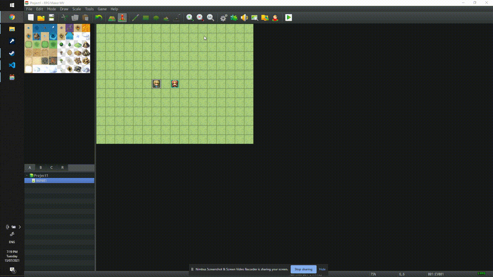

# rpgtkoolmv_burmese_patch

Burmese characters are formed by combining glyphs. A glyph is a (Unicode) character. RPG Maker MV shows English text one (Unicode) character at a time and, thus, shows Burmese glyphs separately (instead of Burmese characters). This patch plug-in solves this by changing behavior of RPG Maker MV.

## How to install

[How to install plugins on YouTube](https://www.youtube.com/watch?v=ym_qA6hO5d0)
